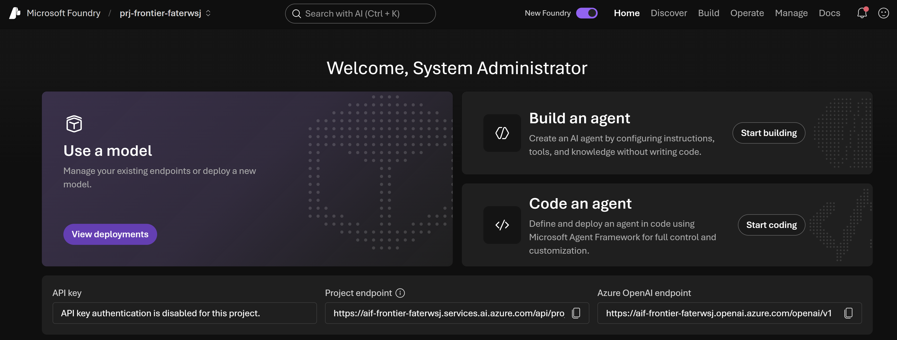
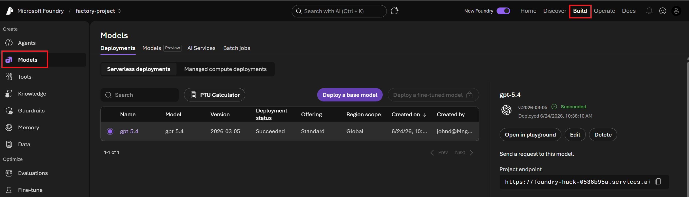

# Desafio 0: Crie seu projeto Foundry

Tempo: ~25 minutos

## Objetivos

Ao final deste desafio, você terá:

- ✅ Um recurso e um projeto do Microsoft Foundry criados a partir do portal do Azure
- ✅ Um modelo de chat implantado e testado no playground
- ✅ Application Insights conectado ao seu projeto, pronto para o Desafio 2


## Pré-requisitos

- Um navegador web moderno
- Uma assinatura do Azure na qual você tenha as funções **Contributor** e **Foundry User**
- O nome da **região** do Azure que o instrutor pediu para você usar (este laboratório utiliza **Sweden Central**)

> [!NOTE]
> Não há nada para instalar. Não clone o repositório, não crie um ambiente virtual nem use um terminal — tudo abaixo acontece no navegador.

---

## Etapa 1 — Criar o recurso Microsoft Foundry

1. Acesse [portal.azure.com](https://portal.azure.com) e faça login.
2. Na caixa de pesquisa superior, digite **Azure AI Foundry** e selecione-o nos resultados de **Services**.
3. Selecione **+ Create** e, em seguida, **Azure AI Foundry**.
4. Preencha a aba **Basics**:

   | Campo | Valor |
   |---|---|
   | **Subscription** | A assinatura designada pelo instrutor |
   | **Resource group** | Selecione **Create new** e nomeie como `rg-hack-dev-XXX` |
   | **Region** | **Sweden Central** (ou a região informada pelo instrutor) |
   | **Name** | `foundry-hack-dev-XXX` — deve ser globalmente único |
   | **Project name** | `agro-tech-portal-project` |

5. Deixe as demais abas com os valores padrão. Selecione **Review + create** e depois **Create**.
6. Aguarde a mensagem **Your deployment is complete** e selecione **Go to resource**.

> [!TIP]
> Use nomes curtos, em minúsculas e sem espaços. Se o portal indicar que o nome já está em uso, adicione um número ao final.

Seu grupo de recursos deve ficar parecido com isto:


> [!NOTE]
> Os prefixos dos nomes de recursos variam de acordo com o cenário, e os sufixos são únicos para cada implantação. Sua lista não será exatamente igual.

---

## Etapa 2 — Abrir o projeto no portal do Foundry

1. Acesse [ai.azure.com/nextgen](https://ai.azure.com/nextgen) e faça login com a mesma conta.
2. Se você não for direcionado automaticamente ao seu projeto, use o seletor de projetos no canto superior direito e selecione **agro-tech-portal-project**.



Mantenha esta aba aberta — você usará ela durante todo o restante do laboratório.

---

## Etapa 3 — Implantar um modelo

1. Na navegação superior, selecione **Build** e depois **Models** na barra lateral esquerda.

   > [!NOTE]
   > Em algumas versões do portal do Foundry, a aba **Models** é chamada de **Deployments**. Ambas têm a mesma finalidade.

2. Selecione **+ Deploy model** → **Deploy base model**.
3. Procure por um modelo de chat — este laboratório foi escrito para o **gpt-5.4**. Se ele não estiver disponível na sua região, escolha o modelo GPT de chat mais recente aprovado pelo instrutor.
4. Selecione o modelo e depois **Confirm**.
5. Mantenha o **Deployment name** sugerido e anote-o — você selecionará este modelo ao criar cada agente.
6. Selecione **Deploy** e aguarde até que o status mostre **Succeeded**.



---

## Etapa 4 — Testar o modelo no playground

1. Selecione sua implantação e depois **Open in playground**.
2. Digite uma mensagem simples, por exemplo:

   ```text
   In one sentence, what does a soil moisture reading of 18% suggest for a strawberry crop?
   ```

3. Envie e confirme que você recebeu uma resposta.


Se ocorrer um erro aqui, pare e corrija antes de continuar — todos os desafios seguintes dependem de uma implantação de modelo funcional.

---

## Etapa 5 — Conectar o Application Insights

Você precisará disso para o Desafio 2. Configurar agora significa que o Desafio 2 será puramente exploratório.

1. No portal do Foundry, vá em **Observability** → **Tracing** na barra lateral esquerda.
2. Se aparecer o banner **"Create or connect an App Insights resource to get started"**, selecione **Connect**.
3. No painel, escolha um recurso de Application Insights existente ou selecione **Create new** e aceite o nome sugerido.
4. Confirme. O banner desaparece e a visualização de Tracing fica disponível.

> [!NOTE]
> A visualização de Tracing estará vazia por enquanto — isso é esperado. Você gerará rastreamentos no Desafio 1 e os lerá no Desafio 2.

<!-- TODO: screenshot — Observability > Tracing "Connect App Insights" panel -->

---

## Critérios de sucesso

- [ ] Seu grupo de recursos no portal do Azure contém um recurso Microsoft Foundry
- [ ] Você consegue abrir **agro-tech-portal-project** em [ai.azure.com/nextgen](https://ai.azure.com/nextgen)
- [ ] Sua implantação de modelo mostra o status **Succeeded**
- [ ] Você recebeu uma resposta no playground do modelo
- [ ] **Observability → Tracing** mostra um recurso Application Insights conectado, e não o banner de conexão

Próximo: [Desafio 1 — Construir agentes](../challenge-1-build/README.md)
