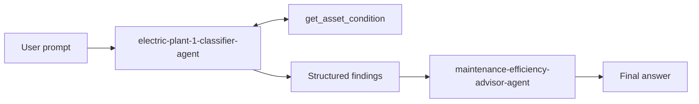

# Challenge 4: Build a visual workflow

Time: ~25 minutes

## Objectives
- ✅ Connect classifier evidence to advisor action in a visible portal workflow

## Context
The visual handoff preserves separation between measurement classification and action advice.



## Get started

1. In Foundry, open **Build** → **Workflows** → **+ New workflow**. Name it `electric-plant-response`.
2. Add an **Agent** node named `classify`, select `electric-plant-1-classifier-agent`, connect **Start → classify**, and use the workflow input as its input.
3. Add an **Agent** node named `advise`, select `maintenance-efficiency-advisor-agent`, and connect **classify → advise**.
4. Use the portal variable picker to insert the classifier output into this advisor input template:

   ```text
   Use only these classifier findings:
   <classifier_findings>
   {{classify.output}}
   </classifier_findings>
   Provide actions, urgency, and escalation.
   ```

   The exact expression may differ by portal version; select the `classify` output from the variable picker rather than typing an unsupported expression.

5. Connect **advise → End**, save, and run with:

   ```text
   Analyze DRIVE-101, DRIVE-102, DRIVE-103, DRIVE-104, and DRIVE-105 using current tool data, then recommend maintenance actions.
   ```

6. Open run details. Confirm `classify` called `get_asset_condition`, produced 2 normal / 2 warning / 1 critical, and passed that table into `advise`. Confirm the final output requires controlled shutdown and safety/maintenance escalation for DRIVE-103.
7. Open **Observability** → **Tracing** and inspect the complete workflow trace, both agent steps, and the OpenAPI tool calls.

## Success criteria
- [ ] Start → classify → advise → End is connected
- [ ] The classifier's OpenAPI tool is invoked
- [ ] The advisor uses the classifier output and does not invent readings
- [ ] Every handoff is visible in run details

Next: [Wrap up](../wrapup.md)