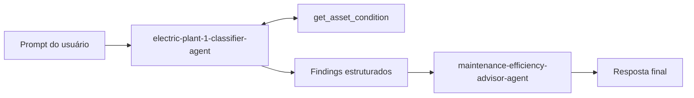

# Challenge 4: Construir um fluxo de trabalho visual

Tempo: ~25 minutos

## Objetivos
- ✅ Conectar as evidências do classificador à ação do advisor em um fluxo de trabalho visual no portal

## Contexto
A passagem visual preserva a separação entre a classificação de medições e a recomendação de ações.



## Primeiros passos

1. No Foundry, abra **Build** → **Workflows** → **+ New workflow**. Nomeie-o `electric-plant-response`.
2. Adicione um nó **Agent** chamado `classify`, selecione `electric-plant-1-classifier-agent`, conecte **Start → classify** e use a entrada do fluxo de trabalho como sua entrada.
3. Adicione um nó **Agent** chamado `advise`, selecione `maintenance-efficiency-advisor-agent` e conecte **classify → advise**.
4. Use o seletor de variáveis do portal para inserir a saída do classificador neste modelo de entrada do advisor:

   ```text
   Use somente estes achados do classificador:
   <classifier_findings>
   {{classify.output}}
   </classifier_findings>
   Forneça ações, urgência e escalonamento.
   ```

   A expressão exata pode variar conforme a versão do portal; selecione a saída de `classify` no seletor de variáveis em vez de digitar uma expressão não suportada.

5. Conecte **advise → End**, salve e execute com:

   ```text
   Analise MOTOR-201, GEN-301, XFR-401, DRIVE-101 e VFD-501 usando os dados atuais da ferramenta e, em seguida, recomende ações de manutenção.
   ```

6. Abra os detalhes da execução. Confirme que `classify` chamou `get_asset_condition`, produziu 2 normal / 2 aviso / 1 crítico e passou essa tabela para `advise`. Confirme que a saída final exige desligamento controlado e escalonamento de segurança/manutenção para o XFR-401.
7. Abra **Observability** → **Tracing** e inspecione o trace completo do fluxo de trabalho, as duas etapas de agentes e as chamadas de ferramenta OpenAPI.

## Critérios de sucesso
- [ ] Start → classify → advise → End está conectado
- [ ] A ferramenta OpenAPI do classificador é invocada
- [ ] O advisor usa a saída do classificador e não inventa leituras
- [ ] Cada passagem é visível nos detalhes da execução

Próximo: [Encerramento](../wrapup.md)