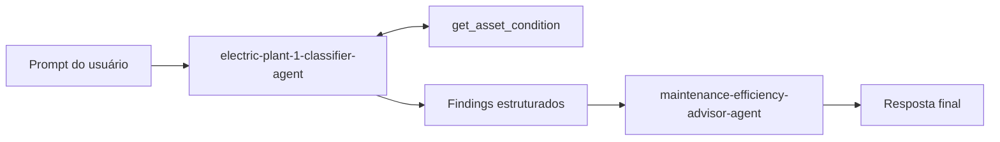

# Challenge 4: Orquestrar classificador e advisor

Tempo: ~25 minutos

## Objetivos
- ✅ Executar uma passagem visível de classificador para advisor com saídas de ferramentas correlacionadas

## Contexto
O fluxo de trabalho mantém separada a classificação das evidências das recomendações.



## Primeiros passos

1. Execute a orquestração pela pasta do laboratório:

   ```powershell
   Set-Location labs/electric-plant
   python challenge-4-workflow/orchestrate.py
   ```

2. O script primeiro lista os agentes implantados e falha claramente com `Challenge 1 is required` se um dos nomes exatos estiver ausente.
3. Acompanhe o loop do classificador em `agents.py`: leia cada `function_call`, execute o `get_asset_condition` correspondente, envie um `FunctionCallOutput` com o mesmo `call_id` e repita até o modelo retornar o texto final. As chamadas do Azure AI Search do advisor são resolvidas pelo serviço e não exigem execução local.
4. Observe a saída do classificador passada entre os delimitadores `<classifier_findings>`. O advisor ancora as recomendações nesse contexto e nas diretrizes da base de conhecimento (Azure AI Search).
5. Estágios esperados no terminal:
   - `Stage 1` imprime uma tabela com 2 ✅ normal, 2 ⚠️ aviso e o XFR-401 🔴 crítico.
   - `Stage 2` recomenda desligamento controlado e escalonamento de segurança/manutenção para o XFR-401 com a fonte citada, trabalho planejado para os ativos em aviso e monitoramento para os ativos normais, também citando a base de conhecimento.
   - As conversas e o client do projeto são encerrados ao final da execução.

## Critérios de sucesso
- [ ] A execução termina e chama `get_asset_condition`
- [ ] O advisor recebe os findings estruturados do classificador
- [ ] O XFR-401 recebe orientação de desligamento controlado e escalonamento
- [ ] O advisor cita a base de conhecimento nas ações recomendadas
- [ ] Cada estágio está visível na saída do terminal e nos traces do Foundry

Próximo: [Encerramento](../wrapup.md)