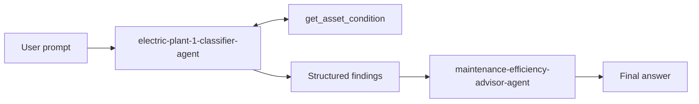

# Challenge 4: Orchestrate classifier and advisor

Time: ~25 minutes

## Objectives
- ✅ Run a visible classifier-to-advisor handoff with correlated tool outputs

## Context
The workflow keeps evidence classification separate from recommendations.



## Get started

1. Run the orchestration from the lab folder:

   ```powershell
   Set-Location labs/electric-plant
   python challenge-4-workflow/orchestrate.py
   ```

2. The script first lists deployed agents and fails clearly with `Challenge 1 is required` if either exact name is missing.
3. Follow the classifier loop in `orchestrate.py`: read every `function_call`, execute the matching `get_asset_condition`, send a `FunctionCallOutput` with the same `call_id`, and repeat until the model returns final text.
4. Observe the classifier output passed between `<classifier_findings>` delimiters. The advisor receives no raw tool and must use only this context.
5. Expected terminal stages:
   - `Stage 1` prints a table with 2 ✅ normal, 2 ⚠️ warning, and DRIVE-103 🔴 critical.
   - `Stage 2` recommends controlled shutdown and safety/maintenance escalation for DRIVE-103, planned work for warning assets, and monitoring for normal assets.
   - Conversations and the project client are closed when execution ends.

## Success criteria
- [ ] The run completes and invokes `get_asset_condition`
- [ ] The advisor receives the classifier's structured findings
- [ ] DRIVE-103 receives controlled-shutdown and escalation guidance
- [ ] Each stage is visible in terminal output and Foundry traces

Next: [Wrap up](../wrapup.md)